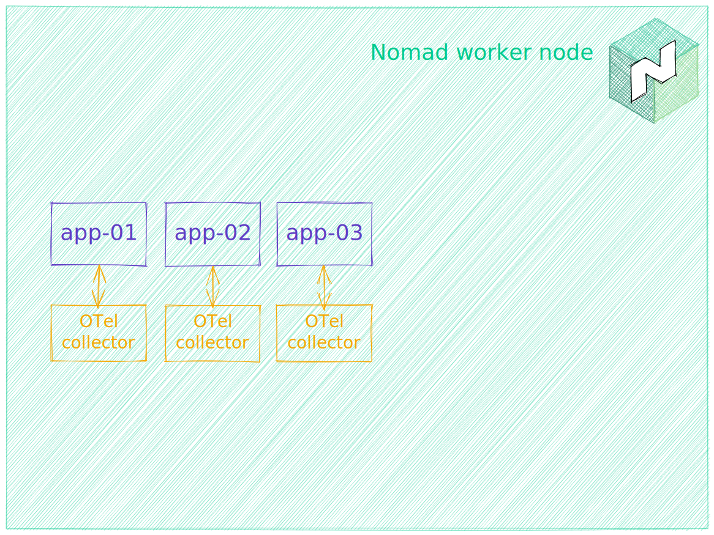
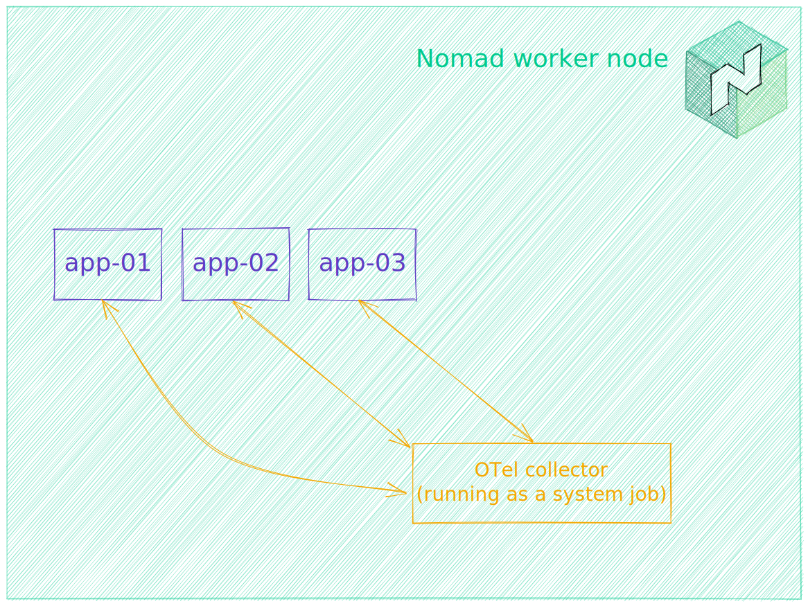
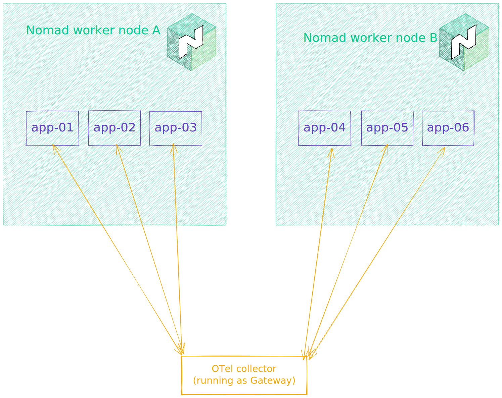
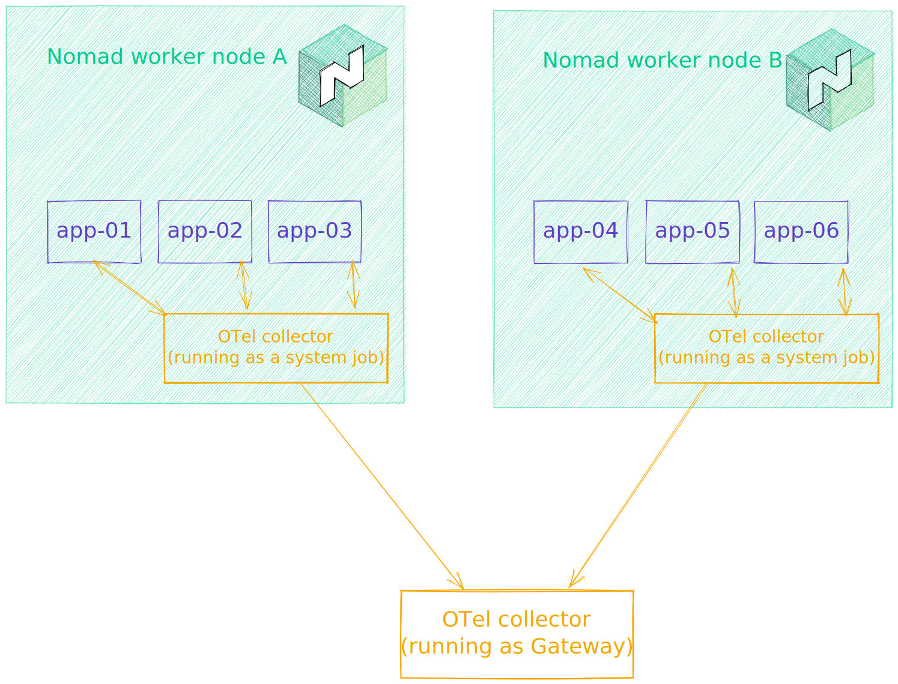
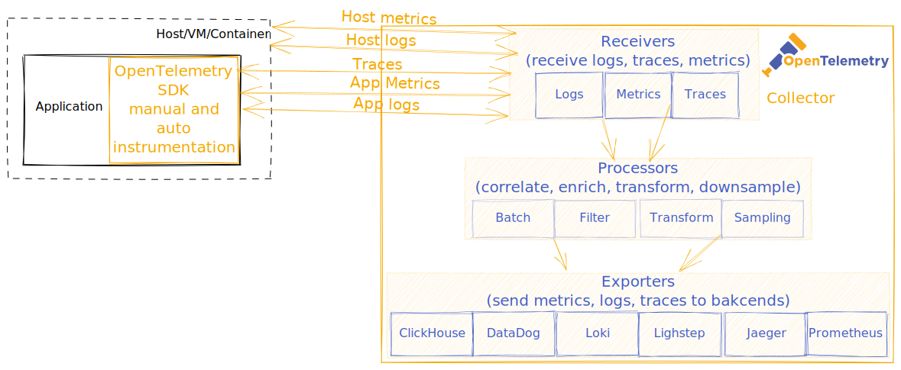

<!-- _backgroundColor: #000000 -->
<!-- _color: #ffffff -->
<!-- _class: nomad -->

# Nomad
## *Complete observability with OpenTelemetry on Nomad*


 


---
<!-- header: Complete observability with OpenTelemetry on Nomad -->

# whoami

- ex-dev, ex-SRE
- Architect @HashiCorp since 2022
- HashiCorp Ambassador 2021 and 2022

https://atodorov.me/

---
# Intro to Observability 

---
## Predecessors

Check-style monitoring with Nagios, Centreon, Zabbix, etc. - Is this service running/port open?

Application Performance Monitoring with New Relic, AppDynamics with proprietary magic - What is my application doing? Are DB queries or HTTP requests taking the most time?

Metrics collection with Telegraf/InfluxDB, Prometheus - How many requests happened/MB of memory used?

---
## Observability

Observability lets us understand a system from the outside, by letting us ask questions about that system without knowing its inner workings. Furthermore, allows us to easily troubleshoot and handle novel problems (i.e. “unknown unknowns”), and helps us answer the question, “Why is this happening?”

---
## Pillars

- metrics - a measurement of something:
    - counter - sum over time, e.g. number of packets sent for eth0
    - measure - aggregate over time, e.g. number of requests received for the last day
    - observer - point in time value, e.g. memory consumption
- logs - a timestamped text record, either structured (recommended) or unstructured, with metadata
- traces - complete view into a request/action made by a user or an application. They are composed of spans, which represent a single unit of work or operation (function call, HTTP request, database query, etc.)

---
<!-- header: Intro to OpenTelemetry -->

# Intro to OpenTelemetry

OpenTelemetry (OTel) is a vendor-neutral framework for instrumenting, generating, collecting, correlating and exporting telemetry data (traces, metrics, and logs).

It supports a variety of formats, including OTLP (its own), as well as Prometheus, Jaeger, Zipkin, etc.

---

## Instrumentation

- Manual - install libraries/SDK, include in code, initialise, add trace/span/metric/logs code
- Automatic instrumentation - install libraries/SDK, *magic*

---
### Manual instrumentation with Python

```bash
pip install opentelemetry-api
pip install opentelemetry-sdk
```

```python
from opentelemetry import trace
from opentelemetry.sdk.trace import TracerProvider
from opentelemetry.sdk.trace.export import (
    BatchSpanProcessor,
    ConsoleSpanExporter,
)

provider = TracerProvider()
processor = BatchSpanProcessor(ConsoleSpanExporter())
provider.add_span_processor(processor)

# Sets the global default tracer provider
trace.set_tracer_provider(provider)

# Creates a tracer from the global tracer provider
tracer = trace.get_tracer(__name__)

def do_work():
    with tracer.start_as_current_span("span-name") as span:
        # do some work that 'span' will track
        print("doing some work...")
        # When the 'with' block goes out of scope, 'span' is closed for you
```

---
### Automatic instrumentation with Python

```bash
pip install opentelemetry-distro
opentelemetry-bootstrap -a install
opentelemetry-instrument python xx.py
```

---
<!-- header: OpenTelemetry Collector -->

# OpenTelemetry Collector

A binary that receives/collects (push and pull) telemetry, processes it, and sends it to respective backends.

Everything happens in pipelines composed of:

- receivers - Jaeger, File, Prometheus, HTTP, HAProxy, AWS X-Ray, Kafka, Kubernetes, OTLP, MySQL, etc.
- processors - transform, filter, batch, attribute, etc.
- exporters - Loki, Jaeger, Zipkin, DataDog, Lighstep, Splunk, Prometheus, etc.

---
<!-- header: OpenTelemetry Collector -->

## Deployment pattern: Sidecar



Sidecar agent pattern
(OpenTelemetry Collector running with each application as a task within the applications' task group)


---
## Deployment pattern: Agent



Host agent pattern
(OpenTelemetry Collector running on each Nomad worker as a system job)

---
## Deployment pattern: Gateway



Gateway pattern
(OpenTelemetry Collector running centrally for the whole cluster)

---
## Deployment pattern: Mixed Agent + Gateway



Mixed
(OpenTelemetry Collector running on each Nomad worker as a system job + Gateway)

---
## OpenTelemetry collection schema



---
## OpenTelemetry Collector configuration

```yaml
processors:
  attributes/nomad:
    actions:
      - key: "nomad.region"
        action: "insert"
        value: "{{ env "NOMAD_REGION" }}"
      - key: "nomad.dc"
        action: "insert"
        value: "{{ env "NOMAD_DC" }}"
```
```yaml
exporters:
  prometheus:
    endpoint: "0.0.0.0:{{ env "NOMAD_PORT_prometheus" }}"
  otlp:
    endpoint: '{{ range nomadService "jaeger-collector" }}{{ .Address }}:{{ .Port }}{{ end }}'
    tls:
      insecure: true
  otlp/ls:
    endpoint: ingest.lightstep.com:443
    headers: 
      "lightstep-access-token": "{{ with nomadVar "nomad/jobs/otel-collector" }}{{ .lighstep_access_token }}{{ end }}"
```
```yaml
  pipelines:
    metrics:
      receivers: [otlp]
      processors: [attributes/nomad, batch]
      exporters: [prometheus, logging, otlp/ls]
```

---
<!-- header: Demo -->

# OpenTelemetry Demo App

Ported to Nomad by [Adri Villela](https://adri-v.medium.com/)


---
# Demo

- OpenTelemetry Collector deployed as a host agent (system job) on Nomad
- OpenTelemetry Demo app deployed on Nomad
- Observability backends (Prometheus, Jaeger) deployed on Nomad
